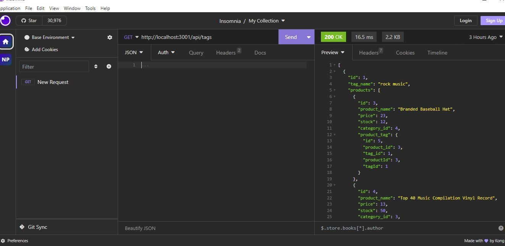

# ECOMMERCE

## Description
My motivation behind this project was to make it easy to enter records,update,delete easily in the company's database. Appropriate routes are defined to carry out these tasks. Tables and associations between them are defined with Sequelize

  ## Github Repo link: 
  https://github.com/Nehaps29/ecommerce

  ## Short Video Link showing how it is generated: 

  

  ## Picture of Tag details via insomnia
  
  

  ## Table of Content

  - [Installation](#installation)
  - [Usage](#usage)
  - [Contribution Details](#contribution-details)
  - [Test Instructions](#test-instructions) 
  - [License](#licenses)
  - [Contact](#contact)
  
  

  ## Installation: 
    Express, MySQL and Sequelize, Insomnia

  ## Usage:
  to manage company's employee tracker

  ## Contribution Details: 
    Source code from rutgers gitlab
    Neha Sabannavar, Rutgers TA, Xpert Learning Assistant, AskBCS

  ## Test Instructions: 
   Command to run the script : 
   - create the database by running schema file: source db/schema.sql
   - npm run seed
   - npm i && npm start

  ## Licenses: 
  MIT
      
  https://opensource.org/licenses/MIT 

  
  ## Contact: 
  Below mentioned is my github profile link 

  ## Github: https://github.com/nehaps29
  

  